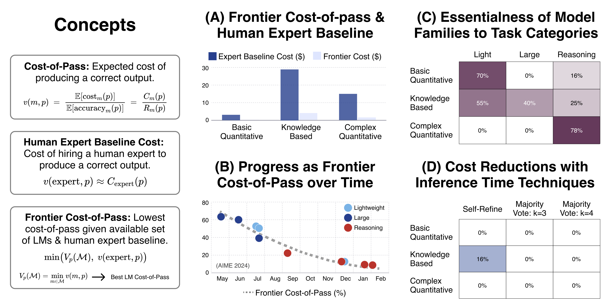

<div align="center">

# Cost-of-Pass: An Economic Framework for Evaluating Language Models
[](https://arxiv.org/abs/2504.13359)
[](https://huggingface.co/CostOfPass)

🚧 **This repository is under construction. More details coming soon!** 🚧
</div>


## Index
- [Overview](#overview)
- [Setup](#setup)
- [Examples](#examples)
- [Detailed Usage](#detailed-usage)
- [Citation](#citation)

## Overview
<div align="center">
    
</div> <br>
The widespread adoption of AI systems in the economy hinges on their ability to generate economic value that outweighs their inference costs. Evaluating this tradeoff requires metrics that account for both performance and costs.

We propose a framework grounded in production theory for evaluating language models by combining accuracy and inference cost. We introduce **Cost-of-Pass**, the expected monetary cost of generating a correct solution. We then define the **Frontier Cost-of-Pass** as the minimum Cost-of-Pass achievable across available models or *the human expert*, using the approximate cost of hiring an expert.

With our framework, we quantify the economic benefit that language models provide over an human expert baseline. We then track the evolution of cost-efficiency over the past year across different task types, evaluate the essentialness of various model innovations, and assess the economic value of common inference-time techniques.

Our findings point to clear trends in cost-efficiency across model classes and task types, reflecting the broader dynamics of innovation in the field. These patterns, and the shifts we've observed over time, offer a window into how economic value is increasingly shaped by model-level advances rather than surface-level improvements.

## Setup
Our repository integrates [LiteLLM](https://github.com/BerriAI/litellm/tree/main) for querying language models and uses [Hugging Face](https://huggingface.co/CostOfPass) to store and share evaluation results. Follow these steps to setup the repository:

1. **Clone the repository** 
2. **Create a Python environment:** Use a tool like `Conda` or `venv`. For instance:
```bash
conda create -n cost_of_pass python=3.11
conda activate cost_of_pass
```
3. **Install the package:** Run the following command from the repository root:
```bash
pip install -e .
```
4. **Configure API access:** To query models via LiteLLM (or your custom API) and push results to the Hugging Face Hub (of yours / ours), create a `.env` file with the necessary credentials:
```bash
OPENAI_API_KEY=...
ANTHROPIC_API_KEY=...
HF_TOKEN=...
# Add other relevant keys as needed
```

## Examples

### Creating a Client
```python
from cost_of_pass import get_client, list_clients, SamplingArgs

# List the clients, you should get ~everything available in litellm.
print("Available Clients:", list_clients())

# Retrieve a client (adjust key as needed, e.g., 'gpt-4o')
client = get_client("gpt-4o")
```

### Creating a Task
```python
from cost_of_pass import get_task, list_tasks

# List available tasks
print("Available Tasks:", list_tasks())

# Get a specific task
task = get_task("AIME_2024")
print("Task queries:", task.get_queries())
```

### Creating an Inference Time Technique
```python
from cost_of_pass import get_test_time_method, list_test_time_methods

# List available test-time methods
print("Available Test-Time Methods:", list_test_time_methods())

# Get a specific test-time method
test_time_method = get_test_time_method("VanillaPromptMethod")
```

### Measuring with a Metric
```python
from cost_of_pass import get_metric, list_metrics

# List available metrics
print("Available Metrics:", list_metrics())

# Get a specific metric
metric = get_metric("MathExpressionMatch")
```

### Computing Frontier Cost-of-Pass
```python
from cost_of_pass import ModelFamily, FrontierCostofPass

# Create a FrontierCostofPass object
frontier_cop = FrontierCostofPass(
    task=task,
    baseline_cop=20.0, # Human expert cost-of-pass
    metric=metric,
)

# Create a model family
model_family = ModelFamily(name="Example Model Family")

# Add models to the family
model_family = model_family.add_model(
    model=client,
    tt_method=test_time_method,
)

# Estimate the frontier cost-of-pass for the task under the model family
print(
    frontier_cop.estimate_task(
        model_family=model_family,
        n_runs=8,
    )
)
```
## Detailed Usage
### Passing Custom Args
You can pass custom arguments to tasks, inference time methods, and evaluations. 
```python
# Modifying task name and number of samples to work with
task = get_task("GPQA_Diamond", task_name="My_GPQA_Diamond_Task", n_samples=128)

# Some inference time methods may require additional arguments
tt_method = get_test_time_method("MajorityVotingMethod", n_votes=3)

# An alternative way of initializing the FrontierCostofPass object
frontier_cop = FrontierCostofPass(
    task="GPQA_Diamond",
    task_kwargs={"task_name": "My_GPQA_Diamond_Task", "n_samples": 128},
    baseline_cop=58.0,  # Human expert cost-of-pass
    metric="ExactStringMatch",
    metric_kwargs={},
)

# Passing custom runtime arguments when the model is run
model_family = ModelFamily(name="Example Model Family")
model_family = model_family.add_model(
    model=client,
    tt_method=test_time_method,
    runtime_kwargs={
        'sampling_args': SamplingArgs(temperature=0.9, top_p=1.0, max_tokens=2048), # Sampling arguments for the model
        'max_attempts': 5,  # Number of attempts to generate a response
        'sleep_time': 2, # How long to sleep after each failed attempt
        'sleep_multiplier': 1.5, # How much to multiply the sleep time after each failed attempt
        'timeout': 10 # Timeout for the request (i.e. how many seconds should we wait for a response before giving up)
    }
)

# Passing different args to the frontier_cop estimation
frontier_cop.estimate_task(
    model_family=model_family,
    n_runs=8,
    exclude_baseline=True, # Exclude the human expert from the estimation: LM Frontier CoP
    ignore_bad_records=True, # Ignore bad records (e.g. when evaluation fails for a model / problem)
    # kwargs for evaluation
    use_hub_cache=True, # Use the cached evaluation records from the hub (if available)
    update_hub=True, # Update the hub with the newly generated evaluation records
    append=True, # Should append or overwrite the existing records in the hub (if updating)
    workers=64, # Number of workers to use for parallel API calls
    hub_manager_kwargs = { # details for the record management
        'org_id': 'CostOfPass', # The organization ID to use for the hub
        'repo_id': 'benchmark', # The repo ID to use for the hub
        'token': '...', # HF token (in case you want to use a different token than the one in the .env file)
    }
)
```

### Analysis
Please check the `analysis` folder for the notebook on reproducing the analyses in the paper.

### Custom Benchmark
If you would like to create a custom benchmark, using different models, tasks, metrics, inference time methods, or different cost / performance estimations, please check these information and follow the instructions:
**TODO: Coming Soon!**

## Citation
If you find our work useful, please consider citing:
```bibtex
@misc{erol2025costofpass,
      title={Cost-of-Pass: An Economic Framework for Evaluating Language Models}, 
      author={Mehmet Hamza Erol and Batu El and Mirac Suzgun and Mert Yuksekgonul and James Zou},
      year={2025},
      eprint={2504.13359},
      archivePrefix={arXiv},
      primaryClass={cs.AI},
      url={https://arxiv.org/abs/2504.13359}, 
}
```
